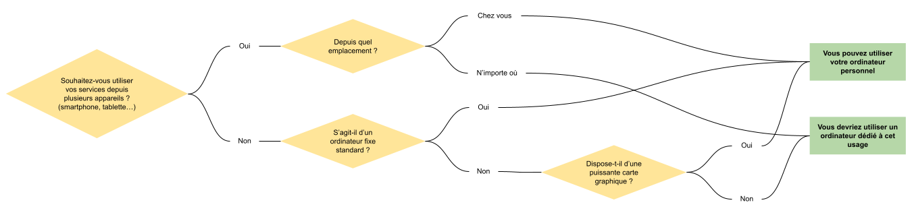
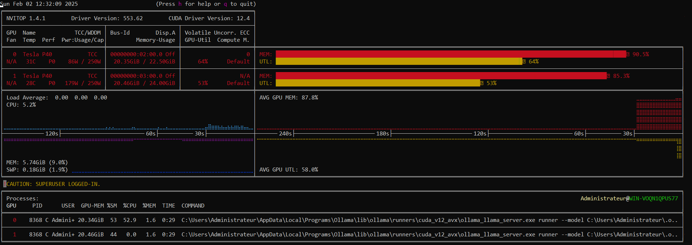
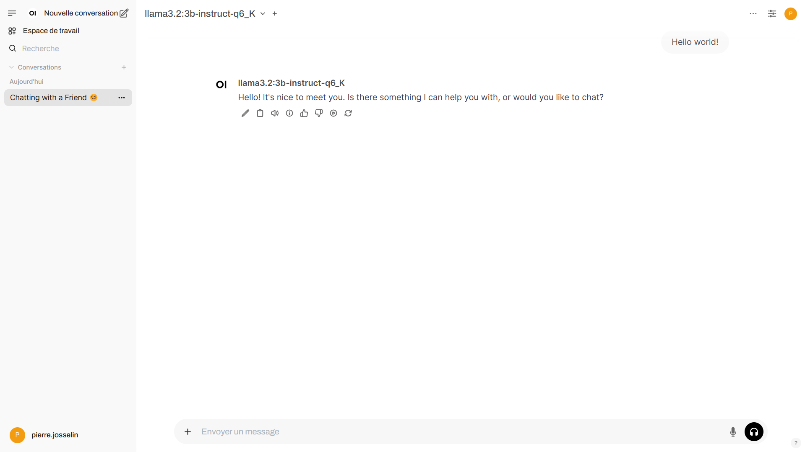
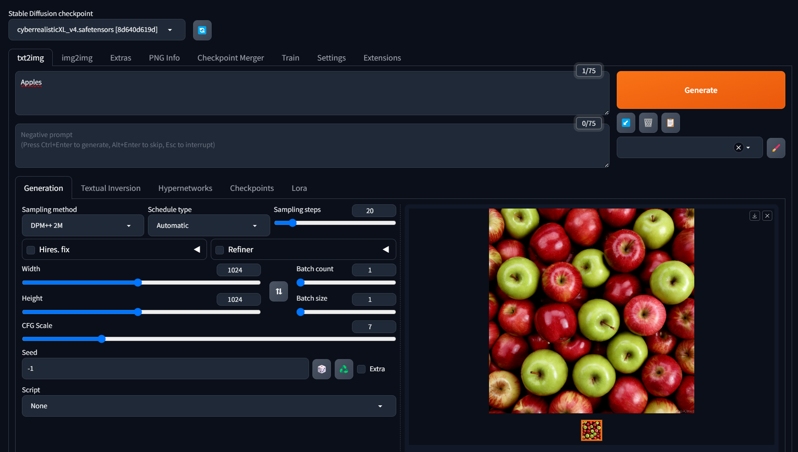

# Guide d'initiation à l'IA générative locale et open source

Je ne suis pas un expert de l'intelligence artificielle, simplement quelqu'un de passionné qui par ce guide va tenter de vous aider à appréhender ce saut dans l'inconnu qu'est l'IA open source.

- [Guide d'initiation à l'IA générative locale et open source](#guide-dinitiation-à-lia-générative-locale-et-open-source)
  - [Avant de commencer](#avant-de-commencer)
    - [Qu'est-ce que l'IA ?](#quest-ce-que-lia-)
    - [Pourquoi locale ?](#pourquoi-locale-)
    - [Pourquoi open source ?](#pourquoi-open-source-)
  - [Le matériel](#le-matériel)
    - [La (ou les) carte(s) graphique(s)](#la-ou-les-cartes-graphiques)
      - [Le constructeur du GPU](#le-constructeur-du-gpu)
      - [La capacité de la mémoire](#la-capacité-de-la-mémoire)
      - [La bande passante de la mémoire](#la-bande-passante-de-la-mémoire)
      - [La performance](#la-performance)
      - [L'architecture](#larchitecture)
      - [La consommation](#la-consommation)
      - [L'interface](#linterface)
      - [La quantité](#la-quantité)
      - [Le prix](#le-prix)
      - [Exemples](#exemples)
    - [Le processeur](#le-processeur)
    - [La mémoire](#la-mémoire)
    - [La carte mère](#la-carte-mère)
    - [Le stockage](#le-stockage)
    - [L'alimentation](#lalimentation)
  - [Le logiciel](#le-logiciel)
    - [Le système d'exploitation](#le-système-dexploitation)
    - [Le pilote de la carte graphique](#le-pilote-de-la-carte-graphique)
    - [Les outils d'IA open source](#les-outils-dia-open-source)
      - [Pinokio](#pinokio)
    - [Les modèles d'IA](#les-modèles-dia)
      - [Les LLM open source](#les-llm-open-source)
        - [Les comparateurs de LLM](#les-comparateurs-de-llm)
      - [La quantification](#la-quantification)
      - [Estimer la quantité de mémoire requise pour l'exécution d'un modèle](#estimer-la-quantité-de-mémoire-requise-pour-lexécution-dun-modèle)
      - [Les sites de téléchargement de modèles d'IA open source](#les-sites-de-téléchargement-de-modèles-dia-open-source)
    - [Le suivi des performances](#le-suivi-des-performances)
  - [Exemples](#exemples-1)
    - [Déployer un chatbot avec une interface similaire à ChatGPT](#déployer-un-chatbot-avec-une-interface-similaire-à-chatgpt)
    - [Générer des images](#générer-des-images)
  - [Contribution](#contribution)
  - [Crédits](#crédits)

## Avant de commencer

### Qu'est-ce que l'IA ?

> L'intelligence artificielle (IA) est un ensemble de théories et de techniques visant à réaliser des machines capables de simuler l'intelligence humaine. <cite>[Wikipedia](https://fr.wikipedia.org/wiki/Intelligence_artificielle)</cite>

> L'intelligence artificielle générative ou IA générative (IAg ou GenAI) est un type de système d'intelligence artificielle (IA) capable de générer du texte, des images, des vidéos ou d'autres médias en réponse à des requêtes (aussi appelées invites, ou en anglais prompts). <cite>[Wikipedia](https://fr.wikipedia.org/wiki/Intelligence_artificielle_g%C3%A9n%C3%A9rative)</cite>

### Pourquoi locale ?

**Vie privée**

Lorsque vous utilisez un service en ligne tel que [ChatGPT](https://openai.com/index/chatgpt/), [Gemini](https://gemini.google.com/) ou encore [Midjourney](https://www.midjourney.com/home), vous partagez des données plus ou moins personnelles. Ces données sont généralement stockées, revendues, ou réutilisées pour entraîner de nouveaux modèles.

**Coût**

La plupart de ces services, bien qu'ils offrent généralement une version gratuite limitée, imposent de souscrire à un abonnement, souvent onéreux, pour accéder aux fonctionnalités complètes.

**Disponibilité**

Vous dépendez de services tiers. En cas de forte affluence ou de panne, vous ne pouvez pas les utiliser.

**Droits d'utilisation du contenu généré**

Cela dépend des conditions d'utilisation du service, mais la plupart du temps le contenu généré ne vous appartiens pas, vous ne pouvez pas l'utiliser librement.

Déployer ses propres services d'IA localement permet de palier à tous ces problèmes. Bien-sûr, c'est un peu plus compliqué que d'utiliser un service en ligne, mais rien d'insurmontable.

> [!NOTE]  
> Veuillez noter que nous aborderons ici l'IA générative locale dans le sens "à domicile". Il est tout à fait possible d'utiliser des serveurs distants hébergés sur [AWS](https://aws.amazon.com/fr/) ou [Google Cloud Platform](https://cloud.google.com/) par exemple.

### Pourquoi open source ?

Open source signifie qu'un logiciel est partagé avec son code source accessible à tous. Cela offre une transparence totale sur son fonctionnement puisque n'importe qui peut analyser son fonctionnement. La plateforme [GitHub](https://github.com/) est majoritairement utilisée pour publier le code source mais ce n'est pas la seule qui existe.

> [!NOTE]  
> La plupart des modèles d'IA publiés de façon open source sont fournis sans les jeux de données qui ont servis à les entraîner, ce qui peut représenter des problèmes éthiques et de transparence majeurs.

> [!NOTE]  
> Open source ne veut pas non plus dire que l'on peut faire ce que l'on veut, il est important de consulter la licence de chacun des produits.

## Le matériel

Pour exécuter des modèles d'IA localement, vous aurez besoin d'un ordinateur. Il peut s'agir de votre ordinateur personnel ou d'une machine dédiée à cet usage. Utilisez le diagramme suivant pour faire votre choix.



Il est possible de générer du contenu par IA de deux façon différentes:

- Avec la carte graphique et sa mémoire dédiée (GPU/VRAM)
- Avec le processeur et la mémoire vive (CPU/RAM)

La seconde option est fortement déconseillée puisqu'elle offre des performance nettement plus basses dans la plupart des cas. En effet, alors que le CPU est conçu pour effectuer un nombre de tâches simultanées limité, le GPU, à l'inverse, est conçu pour en effectuer un grand nombre à la fois, ce qui est particulièrement adapté à la génération de contenu par IA.

### La (ou les) carte(s) graphique(s)

Il s'agit du composant le plus important pour de la génération de contenu par IA. De nombreuses spécifications sont à prendre en compte et nous allons les aborder ici.

#### Le constructeur du GPU

Il existe plusieurs constructeurs de GPU sur le marché ([Nvidia](https://www.nvidia.com/fr-fr/), [AMD](https://www.amd.com/fr.html), [Intel](https://www.intel.fr/content/www/fr/fr/homepage.html)...). Nvidia est généralement fortement recommandé car de nombreux outils utilisent des technologies uniquement disponible sur ces GPU.

#### La capacité de la mémoire

Probablement l'élément le plus important, la capacité de la mémoire vidéo ou VRAM déterminera la taille des modèles que vous pourrez utiliser. Plus elle est élevée, plus vous pourrez utiliser de gros modèles. Si elle est insuffisante, une partie du modèle sera transférée vers la mémoire du CPU (si elle est suffisante) est les performances chuteront drastiquement.

#### La bande passante de la mémoire

Il existe plusieurs types de mémoire vidéo (GDDR5, GDDR6, HBM2...) avec des bandes passantes différentes. Privilégier une bande passante élevée.

#### La performance

Mesurée en [FLOPS](https://fr.wikipedia.org/wiki/FLOPS), la performance dépend facteurs tels que la fréquence et le nombre de coeurs... Une valeur élevée offrira une vitesse de génération plus rapide.

> [!NOTE]  
> La performance est mesurée selon un type de précision spécifique (double, single, half...). Ne comparer les performances de plusieurs GPU que pour une même précision.

#### L'architecture

Privilégiez toujours des architectures récentes. En effet, certains outils utilisent des technologies qui ne sont disponible que sur des GPU relativement récents. Aussi, les architectures récentes ont une bien meilleure efficacité énergétique que les anciennes générations.

Liste des architectures NVIDIA (depuis 2012):

| Nom          | Année |
| ------------ | ----: |
| Blackwell    |  2024 |
| Hopper       |  2022 |
| Ada Lovelace |  2022 |
| Ampere       |  2020 |
| Turing       |  2018 |
| Volta        |  2017 |
| Pascal       |  2016 |
| Maxwell      |  2014 |
| Kepler       |  2012 |

#### La consommation

Il est important de prendre en compte la consommation de la carte graphique puisque cela aura un impact direct sur le coût en électricité de l'utilisation des services, en particulier si vous comptez laisser l'ordinateur sous tension 24 heures sur 24 pour être accessible à tout moment. Une consommation élevée produira également plus de chaleur. Enfin, vous devrez disposer d'une alimentation correctement dimensionnée.

#### L'interface

Les cartes graphiques se connectent à la carte mère généralement via l'interface PCIe (PCI express). Il existe plusieurs générations de PCIe (1.0, 2.0, 3.0...). Toutes les versions sont retro-compatible. Cependant, si vous utilisez une carte graphique PCIe 5.0 sur un port PCIe 3.0 vous ne bénéficierez pas de vitesses de transfert optimales.

#### La quantité

Il est tout à fait possible d'utiliser plusieurs cartes graphiques afin de cumuler la mémoire vidéo et les performances. Cependant tous les outils ne supportent pas cela. Il est aussi possible de les utiliser en parallèle avec des instances d'outils différents.

#### Le prix

C'est généralement l'élément déterminant dans le choix de la carte graphique. Il s'agit de matériel relativement cher, il est donc important de prendre son temps et comparer les offres. Il peut également être intéressant de se tourner vers le marché de l'occasion.

#### Exemples

Voici un tableau comparant les caractéristiques techniques de quelques cartes graphiques potentiellement intéressantes pour de l'IA générative. Attention cependant, il ne s'agit absolument pas de recommandations.

| Nom                              | Mémoire | Type de mémoire |  Performance | Architecture        | Consommation | Interface | Prix au lancement |
| -------------------------------- | ------: | --------------- | -----------: | ------------------- | -----------: | --------- | ----------------: |
| NVIDIA H100 PCIe 80 GB           |   80 GB | HBM2e           | 51.22 TFLOPS | Hopper (2022)       |        350 W | PCIe 5.0  |                 - |
| NVIDIA Tesla P40                 |   24 GB | GDDR5           | 11.76 TFLOPS | Pascal (2016)       |        250 W | PCIe 3.0  |            5699 $ |
| NVIDIA GeForce RTX 5090          |   32 GB | GDDR7           | 104.8 TFLOPS | Blackwell (2024)    |        575 W | PCIe 5.0  |            1999 $ |
| NVIDIA GeForce RTX 4090          |   24 GB | GDDR6X          | 82.58 TFLOPS | Ada Lovelace (2022) |        450 W | PCIe 4.0  |            1599 $ |
| NVIDIA GeForce RTX 4060 Ti 16 GB |   16 GB | GDDR6           | 22.06 TFLOPS | Ada Lovelace (2022) |        165 W | PCIe 4.0  |             499 $ |
| AMD Radeon RX 7900 XTX           |   24 GB | GDDR6           | 61.39 TFLOPS | RDNA 3 (2022)       |        355 W | PCIe 4.0  |             999 $ |

Il existe des outils en ligne pour visualiser et comparer les caractéristiques techniques de différents GPU:

- [TechPowerUp - GPU Specs Database](https://www.techpowerup.com/gpu-specs/)
- [Technical City - Classement des cartes graphiques](https://technical.city/fr/video/rating)

> [!WARNING]  
> Attention aux pièges! Certaines cartes graphiques peuvent sembler vraiment intéressantes alors qu'elles ne seront peut-être pas adaptées à votre usage. C'est le cas de la Nvidia Tesla K80 24GB qui peut être trouvée pour une centaine d'euros sur internet. Premièrement elle fait partie de l'architecture Kepler qui date de 2012 ce qui est vraiment ancien, et il s'agit en réalité de 2 GPU de 12GB qui ne pourront pas pas être utilisés simultanément par la plupart des outils. Enfin, ce type de carte professionnelle est fourni avec une dissipation thermique passive. Il est essentiel prévoir une ventilation adaptée.

### Le processeur

Tant que la capacité de la mémoire vidéo est suffisante pour le modèle utilisé, l'impact du processeur sur la génération est minime même si ce n'est évidemment pas un composant à négliger.

Cependant, pour bénéficier de vitesses de transfert optimales, assurez-vous que le CPU supporte une version de PCIe supérieure ou égale à celle de la carte graphique et, si applicable, à celle du SSD. Dans le cas où vous comptez utiliser plusieurs cartes graphiques, assurez-vous que le CPU dispose d'un nombre de voies PCIe maximum suffisant. Cela dépend de la façon dont la carte mère les utilises, référez-vous à la fiche technique du processeur et au manuel d'utilisation de la carte mère.

### La mémoire

Tant que la capacité de la mémoire vidéo est suffisante pour le modèle utilisé, l'impact du la mémoire (RAM) sur la génération est minime même si ce n'est évidemment pas un composant à négliger.

### La carte mère

Il est important de choisir une carte mère de bonne qualité. Si vous souhaitez utiliser plusieurs cartes graphiques, assurez-vous que la carte mère dispose de suffisamment de ports PCIe, et pour des vitesses de transfert optimales, qu'elle supporte les versions PCIe des cartes graphiques.

> [!WARNING]  
> Une carte mère avec par exemple 4 ports PCIe ne veut pas nécessairement dire que 4 cartes graphiques pourront être utilisées simultanément, ou utilisées simultanément de façon optimale. Référez-vous au manuel d'utilisation de la carte mère.

### Le stockage

Le choix du stockage est important puisqu'il définit à quelle vitesse le modèle pourra être chargé dans la mémoire. De plus, les modèles d'IA font souvent plusieurs giga-octets voire dizaines de giga-octets donc il est important de choisir une capacité suffisante. Préférez l'utilisation d'un SSD M.2 PCIe plutôt qu'un HDD ou même un SSD SATA.

### L'alimentation

L'alimentation est un composant essentiel qui doit être correctement dimensionné, d'autant plus si vous utilisez plusieurs cartes graphiques puissantes. Utilisez un calculateur en ligne pour déterminer quelle alimentation est adaptée. Assurez-vous également que l'alimentation dispose de suffisamment de câbles d'alimentation PCIe.

Quelques outils de calcul d'alimentation en ligne:

- [MSI](https://www.msi.com/power-supply-calculator)
- [be quiet!](https://www.bequiet.com/en/psucalculator)
- [Cooler Master](https://www.coolermaster.com/en-eu/power-supply-calculator/)
- [PC builds](https://pc-builds.com/power-supply-calculator/)

## Le logiciel

### Le système d'exploitation

Une fois votre ordinateur assemblé, la question du choix du système d'exploitation se pose. Deux principales plateformes s'offrent à vous: Windows ou Linux. La quasi totalité des outils sont compatibles avec les deux. Windows peut être plus simple à utiliser, les pilotes graphiques y seront plus simples à installer pour un débutant, alors que le choix d'utiliser Linux peut être totalement justifié dans une démarche "100% libre et open source". De plus, Windows est payant alors que les distributions Linux sont gratuites, encore un élément à prendre en compte. Une fois le choix de la plateforme fait, il faut encore choisir le système d'exploitation le plus adapté à ses besoins. En voici une liste non exhaustive:

- Windows
  - [Windows 11](https://www.microsoft.com/fr-fr/software-download/windows11)
  - [Windows 10](https://www.microsoft.com/fr-fr/software-download/windows10)
  - [Windows Server 2025](https://www.microsoft.com/fr-fr/evalcenter/evaluate-windows-server-2025)
  - [Windows Server 2022](https://www.microsoft.com/fr-fr/evalcenter/evaluate-windows-server-2022)

- Linux
  - [Debian](https://www.debian.org/index.fr.html)
  - [Ubuntu](https://www.ubuntu-fr.org/)
  - [Fedora](https://fedoraproject.org/fr/)
  - [CentOS](https://www.centos.org/)

Pour la plupart de ces systèmes d'exploitation, vous aurez le choix entre une interface graphique ou en ligne de commande. A moins de vraiment savoir ce que vous faites, choisissez l'interface graphique.

### Le pilote de la carte graphique

Une fois le système d'exploitation installé et mis à jour, la première étape sera d'installer le pilote de la (ou les) carte(s) graphique(s). Vous trouverez ci-dessous des liens vers les pages de téléchargement des pilotes graphiques des trois principaux constructeurs:

- [Nvidia](https://www.nvidia.com/fr-fr/drivers/)
- [AMD](https://www.amd.com/fr/support/download/drivers.html)
- [Intel](https://www.intel.fr/content/www/fr/fr/products/docs/discrete-gpus/arc/software/drivers.html)

### Les outils d'IA open source

Les outils utilisent des modèles d'IA pour générer du contenu. En voici une liste non exhaustive:

- [Ollama](https://ollama.com/)
- [Open WebUI](https://openwebui.com/)
- [Stable Diffusion WebUI ](https://github.com/AUTOMATIC1111/stable-diffusion-webui)
- [ComfyUI](https://www.comfy.org/)

#### [Pinokio](https://pinokio.computer/)

Pinokio est un outil particulier et très intéressant puisqu'il s'agit d'une sorte de magasin d'outils IA. De nombreux outils IA peuvent être téléchargés, installés et lancés en un click depuis Pinokio.

### Les modèles d'IA

La taille des modèles d'IA se mesure en nombre de paramètres. Un modèle 70b fait 70 milliards de paramètres, b correspondant à billion.

#### Les LLM open source

Les LLM (large language models ou grand modèles linguistiques) sont des modèles d'IA capables de comprendre et de générer du texte. C'est le type de modèle utilisé par ChatGPT ou Gemini, par exemple.

Voici une liste non exhaustive de LLM open source populaires regroupés par organisation:

- DeepSeek 🇨🇳
  - deepseek-r1 (1.5b, 7b, 8b, 14b, 32b 70b, 671b)
  - deepseek-v3 (671b)

- Meta 🇺🇸
  - llama3.3 (70b)
  - llama3.2-vision (11b, 90b)
  - llama3.2 (1b, 3b)
  - codellama (7b, 13b, 34b, 70b)

- Alibaba 🇨🇳
  - qwen2.5 (0.5b, 1.5b, 3b, 7b, 14b, 32b, 72b)
  - qwen2.5-coder (0.5b, 1.5b, 3b, 7b, 14b, 32b)
  - qwq (32b)

- Microsoft 🇺🇸
  - phi4 (14b)

- Google 🇺🇸
  - gemma2 (2b, 9b, 27b)
  - codegemma (2b, 7b)

- Mistral AI 🇫🇷
  - mistral (7b)
  - mistral-large (123b)
  - mistral-small (22b)

Comme vous pouvez le voir, certains modèles sont spécialisés, par exemple dans la génération de code ou la reconnaissance d'image, alors que d'autres se veulent plus généralistes.

Certains modèles sont capables de raisonner, c'est à dire qu'il vont prendre un certains temps pour réfléchir avant de générer une réponse. C'est le cas des modèles deepseek-r1 et qwq.

##### Les comparateurs de LLM

Comme vous avez pu le voir il existe de nombreux modèles d'IA open source dans de nombreuses versions différentes. Comment choisir ? Il existe des sites web permettant de comparer les performances de ces différents modèles. Comparer non seulement les performances globales mais également les performances selon des critères spécifiques (codage, raisonnement, mathématiques...). Cela permet également de les situer par rapport à d'autres modèles comme ChatGPT par exemple. En voici une liste non exhaustive:

- [LiveBench](https://livebench.ai/)
- [scale](https://scale.com/leaderboard)

#### La quantification

Pour être efficaces, les modèles d'IA sont entraînés avec des jeux de données énormes. Les fichiers en sortie ont donc généralement une taille de plusieurs giga-octets voire dizaines de giga-octets et demandent donc beaucoup de mémoire et de puissance pour les exécuter. Il est possible de réduire drastiquement la taille de ces modèles à l'aide de la quantification. Cela implique une perte de précision du modèle, plus ou moins grande, selon la méthode utilisée.

Voici par exemple les différentes méthodes de quantifications proposée par [llama.cpp](https://github.com/ggerganov/llama.cpp), par taille décroissante, pour un modèle 7b:

| Nom    | Taille | PPL     | Qualité                  | Remarques                        | Recommandé |
| ------ | ------ | ------- | ------------------------ | -------------------------------- | ---------- |
| F32    | 26.00G | -       | Sans perte               |                                  | Non        |
| F16    | 13.00G | -       | Pratiquement sans perte  |                                  | Non        |
| Q8_0   | 6.70G  | +0.0004 | Perte extrêmement faible |                                  | Non        |
| Q6_K   | 5.15G  | +0.0044 | perte extrêmement faible |                                  |            |
| Q5_K   | -      | -       | -                        | Alias pour Q5_K_M                |            |
| Q5_K_M | 4.45G  | +0.0142 | très faible perte        |                                  | Oui        |
| Q5_K_S | 4.33G  | +0.0353 | faible perte             |                                  | Oui        |
| Q5_1   | 4.70G  | +0.0415 | Faible perte             | Legacy, préférer utiliser Q5_K_M |            |
| Q5_0   | 4.30G  | +0.0796 | Équilibrée               | Legacy, préférer utiliser Q4_K_M |            |
| Q4_K   | -      | -       | -                        | Alias pour Q4_K_M                |            |
| Q4_K_M | 3.80G  | +0.0535 | Équilibrée               |                                  | Oui        |
| Q4_K_S | 3.56G  | +0.1149 | Perte significative      |                                  |            |
| Q4_1   | 3.90G  | +0.1846 | Perte substantielle      | Legacy, préférer utiliser Q3_K_L |            |
| Q4_0   | 3.50G  | +0.2499 | perte très élevée        | Legacy, préférer utiliser Q3_K_M |            |
| Q3_K_L | 3.35G  | +0.1803 | Perte substantielle      |                                  |            |
| Q3_K   | -      | -       | -                        | Alias pour Q3_K_M                |            |
| Q3_K_M | 3.06G  | +0.2437 | perte très élevée        |                                  |            |
| Q3_K_S | 2.75G  | +0.5505 | perte très élevée        |                                  |            |
| Q2_K   | 2.67G  | +0.8698 | Perte extrême            |                                  | Non        |

https://github.com/ggerganov/llama.cpp/discussions/2094#discussioncomment-6351796

> [!NOTE]  
> Sur Ollama, depuis la page d'un modèle, cliquer sur "Tags" pour voir la liste des versions et quantifications disponibles.

#### Estimer la quantité de mémoire requise pour l'exécution d'un modèle

Pour estimer la quantité de mémoire requise pour executer un modèle d'IA, la formule suivante peut être utilisée:

```
M = (P x (Q/8)) x 1.2
```

- M: La mémoire vidéo requise exprimée en giga-octets
- P: Le nombre de paramètres du modèles (70 pour un modèle 70b)
- Q: Le nombre de bits utilisés pour charger le modèle (4 pour une quantification Q4_K_M)
- 1.2: Représente une marge de 20% pour les tâches supplémentaires

Exemple avec le modèle llama3.3 en version 70b-instruct-q4_K_M:

```
(70 x (4/8)) * 1.2
```

La quantité de mémoire requise pour ce modèle est d'environ *42GB*.

https://modal.com/blog/how-much-vram-need-inference

#### Les sites de téléchargement de modèles d'IA open source

Il existe plusieurs sites web qui mettent à disposition des modèles d'IA open source, en voici une liste non exhaustive:

- [Ollama](https://ollama.com/search)
- [Civitai](https://civitai.com/models)
- [Hugging Face](https://huggingface.co/models)

> [!NOTE]  
> Le site web Ollama ne permet le téléchargement de modèle directement, il faut pour cela passer par l'outil Ollama.

### Le suivi des performances

Lors de la génération de contenu, il est important de garder un oeil sur la consommation des ressources afin de vérifier les températures ainsi que l'utilisation des différentes ressources (CPU, RAM, GPU, VRAM...). Sous Windows, il y a pour cela le gestionnaire des tâches, onglet "Performance". Plus spécifiquement pour Nvidia, la commande `nvidia-smi` est disponible sur toutes les plateformes et permet de visualiser les informations sur l'utilisation des cartes graphiques. Enfin, je vous recommande l'outil [nvitop](https://github.com/XuehaiPan/nvitop) qui est très aboutit et regroupe toutes les informations importantes (pour Nvidia).


*nvitop*

## Exemples

### Déployer un chatbot avec une interface similaire à ChatGPT


*Open WebUI*

1. Télécharger, installer et exécuter [Ollama](https://ollama.com/download)
2. Télécharger, installer et ouvrir [Pinokio](https://pinokio.computer/)
3. Accéder à la page "Discover" de Pinokio
4. Dans la barre de recherche, saisir "Open WebUI" 
5. Installer Open WebUI
6. Une fois l'installation terminée, appuyer sur "Start" dans le volet gauche
7. Une fois le lancement terminé, appuyer sur "Open Web UI" dans le volet gauche
8. Créer un compte administrateur
9. Dans le menu de sélection de modèle en haut à gauche, saisir le nom d'un modèle à télécharger (par exemple `llama3.2:3b`) 
10. Cliquer sur "Récupérer "llama3.2:3b" depuis Ollama"
11. Une fois le téléchargement du modèle terminé, le sélectionner dans la liste
12. Saisir un prompt et appuyer sur la touche "Entrée"

Vous pouvez facilement gérer les modèles installés à partir d'une console:

- `ollama run` pour discuter avec un modèle directement depuis la console
- `ollama pull` pour télécharger un modèle sans l'éxécuter
- `ollama list` pour lister les modèles téléchargés
- `ollama rm` pour supprimer un modèle
- `ollama help` pour obtenir la liste complète des commandes

### Générer des images


*Stable diffusion WebUI*

1. Télécharger, installer et ouvrir [Pinokio](https://pinokio.computer/)
2. Accéder à la page "Discover" de Pinokio
3. Dans la barre de recherche, saisir "Stable Diffusion web UI" 
4. Installer Stable Diffusion web UI
5. Une fois l'installation terminée, appuyer sur "Start" dans le volet gauche
6. Une fois le lancement terminé, appuyer sur "Open Web UI" dans le volet gauche
7. Choisir et télécharger un modèle (checkpoint) `.safetensors` sur le site [Civitai](https://civitai.com/models)
8. Accéder au répertoire de Pinokio via l'explorateur de fichiers (généralement `C:\pinokio` sous Windows)
9. Déplacer le modèle vers api → automatic1111.git → app → models → Stable-diffusion
10. Cliquer sur le bouton pour actualiser la liste des modèles
11. Sélectionner le modèle téléchargé dans la liste
12. Saisir un prompt et appuyer sur le bouton "Generate"

## Contribution

Toute contribution est bienvenue. Comme précisé au début de ce guide, je ne suis pas un expert, donc il peut comporter des erreurs. N'hésitez pas à apporter des rectifications, améliorations ou traductions via pull request.

## Crédits

- `README.fr.md`

    Rédigé à la main par Pierre Josselin
