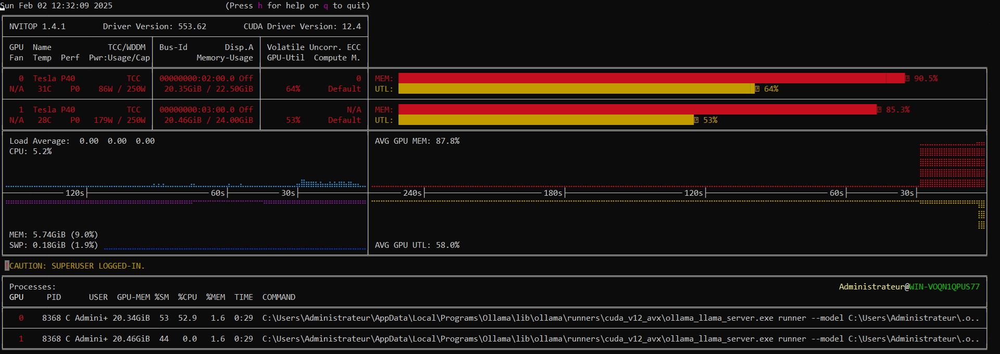

# Introductory guide to local and open source generative AI 

This document is also available in [french](README.fr.md).

I am not an expert in artificial intelligence, simply someone passionate who through this guide will try to help you understand this leap into the unknown that is open source AI.

- [Introductory guide to local and open source generative AI](#introductory-guide-to-local-and-open-source-generative-ai)
  - [Before you start](#before-you-start)
    - [What is AI?](#what-is-ai)
    - [Why local?](#why-local)
    - [Why open source?](#why-open-source)
  - [Hardware](#hardware)
    - [The graphics card(s)](#the-graphics-cards)
      - [The GPU manufacturer](#the-gpu-manufacturer)
      - [The memory capacity](#the-memory-capacity)
      - [Memory bandwidth](#memory-bandwidth)
      - [Performance](#performance)
      - [Architecture](#architecture)
      - [Power Consumption](#power-consumption)
      - [Interface](#interface)
      - [Quantity](#quantity)
      - [Price](#price)
      - [Examples](#examples)
    - [The processor](#the-processor)
    - [Memory](#memory)
    - [The motherboard](#the-motherboard)
    - [Storage](#storage)
    - [Power supply](#power-supply)
  - [Software](#software)
    - [The operating system](#the-operating-system)
    - [The graphics card driver](#the-graphics-card-driver)
    - [Open source AI tools](#open-source-ai-tools)
      - [Pinokio](#pinokio)
    - [AI models](#ai-models)
      - [Open source LLMs](#open-source-llms)
        - [LLM comparators](#llm-comparators)
      - [Quantification](#quantification)
      - [Estimating the amount of memory required to run a model](#estimating-the-amount-of-memory-required-to-run-a-model)
      - [Open source AI model download sites](#open-source-ai-model-download-sites)
    - [Performance monitoring](#performance-monitoring)
  - [Examples](#examples-1)
    - [Deploying a chatbot with an interface similar to ChatGPT](#deploying-a-chatbot-with-an-interface-similar-to-chatgpt)
    - [Generate images](#generate-images)
  - [Contribution](#contribution)
  - [Credits](#credits)

## Before you start 

### What is AI?

> Artificial intelligence (AI) is a set of theories and techniques aimed at creating machines capable of simulating human intelligence. <cite>[Wikipedia](https://en.wikipedia.org/wiki/Artificial_intelligence)</cite> 

> Generative artificial intelligence or generative AI (GenAI) is a type of artificial intelligence (AI) system capable of generating text, images, videos or other media in response to requests (also called prompts). <cite>[Wikipedia](https://en.wikipedia.org/wiki/Generative_artificial_intelligence)</cite> 

### Why local? 

**Privacy** 

When you use an online service such as [ChatGPT](https://openai.com/index/chatgpt/), [Gemini](https://gemini.google.com/) or [Midjourney](https://www.midjourney.com/home), you share more or less personal data. This data is generally stored, resold, or reused to train new models. 

**Cost** 

Most of these services, although they generally offer a limited free version, require a subscription, often expensive, to access the full features. 

**Availability** 

You depend on third-party services. In the event of high traffic or outage, you cannot use them. 

**Rights to use generated content** 

This depends on the terms of use of the service, but most of the time the generated content does not belong to you, you cannot use it freely. 

Deploying your own AI services locally helps overcome all these problems. Of course, it's a bit more complicated than using an online service, but nothing insurmountable. 

> [!NOTE]   
> Please note that we will discuss local generative AI here in the "at home" sense. It is quite possible to use remote servers hosted on [AWS](https://aws.amazon.com/) or [Google Cloud Platform](https://cloud.google.com/) for example. 

### Why open source? 

Open source means that a software is shared with its source code accessible to everyone. This offers total transparency on its operation since anyone can analyze its operation. The [GitHub](https://github.com/) platform is mainly used to publish the source code but it is not the only one that exists. 

> [!NOTE]   
> Most AI models published in open source are provided without the datasets that were used to train them, which can represent major ethical and transparency issues. 

> [!  [NOTE] 
> Open source does not mean that you can do whatever you want, it is important to consult the license of each product.

## Hardware 

To run AI models locally, you will need a computer. This can be your personal computer or a machine dedicated to this purpose. Use the following diagram to make your choice. 

 

There are two different ways to generate AI content: 

- With the graphics card and its dedicated memory (GPU/VRAM) 
- With the processor and RAM (CPU/RAM) 

The second option is strongly discouraged since it offers significantly lower performance in most cases. Indeed, while the CPU is designed to perform a limited number of simultaneous tasks, the GPU, on the contrary, is designed to perform a large number of them at once, which is particularly suitable for AI content generation. 

### The graphics card(s) 

This is the most important component for AI content generation. There are many specifications to consider and we will cover them here. 

#### The GPU manufacturer 

There are several GPU manufacturers on the market ([Nvidia](https://www.nvidia.com/en-us/), [AMD](https://www.amd.com/en.html), [Intel](https://www.intel.com/content/www/us/en/homepage.html)...). Nvidia is generally highly recommended because many tools use technologies only available on these GPUs. 

#### The memory capacity 

Probably the most important element, the capacity of the video memory or VRAM will determine the size of the models you can use. The higher it is, the larger models you can use. If it is insufficient, part of the model will be transferred to the CPU memory (if it is sufficient) and the performance will drop drastically. 

#### Memory bandwidth 

There are several types of video memory (GDDR5, GDDR6, HBM2...) with different bandwidths. Favor a high bandwidth. 

#### Performance 

Measured in [FLOPS](https://en.wikipedia.org/wiki/Floating_point_operations_per_second), performance depends on factors such as frequency and number of cores... A high value will offer a faster generation speed. 

> [!NOTE]   
> Performance is measured according to a specific type of precision (double, single, half...). Only compare the performance of several GPUs for the same precision. 

#### Architecture 

Always favor recent architectures. Indeed, some tools use technologies that are only available on relatively recent GPUs. Also, recent architectures have much better energy efficiency than older generations. 

List of NVIDIA architectures (since 2012):

| Name         | Year |
| ------------ | ---: |
| Blackwell    | 2024 |
| Hopper       | 2022 |
| Ada Lovelace | 2022 |
| Ampere       | 2020 |
| Turing       | 2018 |
| Volta        | 2017 |
| Pascal       | 2016 |
| Maxwell      | 2014 |
| Kepler       | 2012 |

#### Power Consumption 

It is important to consider the power consumption of the graphics card since this will have a direct impact on the electricity cost of using the services, especially if you plan to leave the computer on 24 hours a day to be accessible at all times. High power consumption will also produce more heat. Finally, you will need to have a properly sized power supply. 

#### Interface 

Graphics cards connect to the motherboard usually via the PCIe (PCI express) interface. There are several generations of PCIe (1.0, 2.0, 3.0...). All versions are backward compatible. However, if you use a PCIe 5.0 graphics card on a PCIe 3.0 port you will not benefit from optimal transfer speeds. 

#### Quantity 

It is entirely possible to use several graphics cards in order to combine video memory and performance. However, not all tools support this. It is also possible to use them in parallel with instances of different tools. 

#### Price 

This is generally the determining factor in choosing a graphics card. This is relatively expensive hardware, so it is important to take your time and compare offers. It may also be interesting to look at the second-hand market. 

#### Examples 

Here is a table comparing the technical characteristics of some graphics cards that are potentially interesting for generative AI. Be careful, however, these are absolutely not recommendations. 

| Name                             | Memory | Memory type |  Performance | Architecture        | Consumption | Interface | Price at launch |
| -------------------------------- | -----: | ----------- | -----------: | ------------------- | ----------: | --------- | --------------: |
| NVIDIA H100 PCIe 80 GB           |  80 GB | HBM2e       | 51.22 TFLOPS | Hopper (2022)       |        350W | PCIe 5.0  |               - |
| NVIDIA Tesla P40                 |  24 GB | GDDR5       | 11.76 TFLOPS | Pascal (2016)       |        250W | PCIe 3.0  |           $5699 |
| NVIDIA GeForce RTX 5090          |  32 GB | GDDR7       | 104.8 TFLOPS | Blackwell (2024)    |        575W | PCIe 5.0  |           $1999 |
| NVIDIA GeForce RTX 4090          |  24 GB | GDDR6X      | 82.58 TFLOPS | Ada Lovelace (2022) |        450W | PCIe 4.0  |           $1599 |
| NVIDIA GeForce RTX 4060 Ti 16 GB |  16 GB | GDDR6       | 22.06 TFLOPS | Ada Lovelace (2022) |        165W | PCIe 4.0  |            $499 |
| AMD Radeon RX 7900 XTX           |  24 GB | GDDR6       | 61.39 TFLOPS | RDNA 3 (2022)       |        355W | PCIe 4.0  |            $999 |

There are online tools to view and compare the technical specifications of different GPUs: 

- [TechPowerUp - GPU Specs Database](https://www.techpowerup.com/gpu-specs/) 
- [Technical City - Graphics Card Rankings](https://technical.city/fr/video/rating) 
- [TheDataDaddi - GPU Comparison Tool](https://thedatadaddi.com/hardware/gpucomp) 

> [!WARNING]   
> Beware of the traps! Some graphics cards may seem really interesting while they may not be suitable for your use. This is the case of the Nvidia Tesla K80 24GB which can be found for a hundred euros on the internet. Firstly it is part of the Kepler architecture which dates from 2012 which is really old, and it is actually 2 12GB GPUs that will not be able to be used simultaneously by most tools. Finally, this type of professional card comes with passive heat dissipation. It is essential to provide suitable ventilation. 

### The processor 

As long as the video memory capacity is sufficient for the model used, the impact of the processor on the generation is minimal even if it is obviously not a component to neglect. 

However, to benefit from speeds of For optimal transfer rates, make sure that the CPU supports a PCIe version greater than or equal to that of the graphics card and, if applicable, that of the SSD. In case you plan to use multiple graphics cards, make sure that the CPU has enough maximum PCIe lanes. It depends on how the motherboard uses them, refer to the processor datasheet and motherboard user manual. 

### Memory 

As long as the video memory capacity is sufficient for the model used, the impact of the memory (RAM) on the generation is minimal even if it is obviously not a component to be neglected. 

### The motherboard 

It is important to choose a good quality motherboard. If you want to use multiple graphics cards, make sure that the motherboard has enough PCIe ports, and for optimal transfer speeds, that it supports the PCIe versions of the graphics cards. 

> [!WARNING]  
> A motherboard with, for example, 4 PCIe ports does not necessarily mean that 4 graphics cards can be used simultaneously, or used simultaneously optimally. Refer to the motherboard's user manual. 

### Storage 

The choice of storage is important since it defines how quickly the model can be loaded into memory. In addition, AI models are often several gigabytes or even tens of gigabytes, so it is important to choose sufficient capacity. Prefer using an M.2 PCIe SSD rather than an HDD or even a SATA SSD. 

### Power supply 

The power supply is an essential component that must be correctly sized, especially if you are using several powerful graphics cards. Use an online calculator to determine which power supply is suitable. Also make sure that the power supply has enough PCIe power cables. 

Some online power supply calculator tools: 

- [MSI](https://www.msi.com/power-supply-calculator) 
- [be quiet!](https://www.bequiet.com/en/psucalculator) 
- [Cooler Master](https://www.coolermaster.com/en-eu/power-supply-calculator/) 
- [PC builds](https://pc-builds.com/power-supply-calculator/) 

## Software 

### The operating system 

Once your computer is assembled, the question of choosing the operating system arises. Two main platforms are available to you: Windows or Linux. Almost all tools are compatible with both. Windows can be easier to use, the graphics drivers will be easier to install for a beginner, while the choice of using Linux can be totally justified in a "100% free and open source" approach. In addition, Windows is paid while Linux distributions are free, another element to take into account. Once the choice of platform is made, it is still necessary to choose the operating system best suited to your needs. Here is a non-exhaustive list: 

- Windows 
  - [Windows 11](https://www.microsoft.com/en-us/software-download/windows11) 
  - [Windows 10](https://www.microsoft.com/en-us/software-download/windows10) 
  - [Windows Server 2025](https://www.microsoft.com/en-us/evalcenter/evaluate-windows-server-2025) 
  - [Windows Server 2022](https://www.microsoft.com/en-us/evalcenter/evaluate-windows-server-2022) 

- Linux 
  - [Debian](https://www.debian.org/index.html) 
  - [Ubuntu](https://ubuntu.com/) 
  - [Fedora](https://fedoraproject.org/) 
  - [CentOS](https://www.centos.org/)

For most of these operating systems, you will have the choice between a graphical or command-line interface. Unless you really know what you are doing, choose the graphical interface. 

### The graphics card driver 

Once the operating system is installed and updated, the first step will be to install the driver for the graphics card(s). Below you will find links to the download pages for the graphics drivers of the three main manufacturers: 

- [Nvidia](https://www.nvidia.com/en-us/drivers/) 
- [AMD](https://www.amd.com/en/support/download/drivers.html) 
- [Intel](https://www.intel.com/content/www/us/en/products/docs/discrete-gpus/arc/software/drivers.html) 

### Open source AI tools 

The tools use AI models to generate content. Here is a non-exhaustive list: 

- [Ollama](https://ollama.com/) 
- [Open WebUI](https://openwebui.com/) 
- [Stable Diffusion WebUI ](https://github.com/AUTOMATIC1111/stable-diffusion-webui) 
- [ComfyUI](https://www.comfy.org/) 

#### [Pinokio](https://pinokio.computer/) 

Pinokio is a special and very interesting tool since it is a kind of AI tool store. Many AI tools can be downloaded, installed and launched in one click from Pinokio. 

### AI models 

The size of AI models is measured in the number of parameters. A 70b model has 70 billion parameters, b corresponding to billion. 

#### Open source LLMs 

LLMs (large language models) are AI models capable of understanding and generating text. This is the type of model used by ChatGPT or Gemini, for example. 

Here is a non-exhaustive list of popular open source LLMs grouped by organization: 

- DeepSeek 🇨🇳 
  - deepseek-r1 (1.5b, 7b, 8b, 14b, 32b 70b, 671b) 
  - deepseek-v3 (671b) 

- Meta 🇺🇸 
  - llama3.3 (70b) 
  - llama3.2-vision (11b, 90b) 
  - llama3.2 (1b, 3b) 
  - codellama (7b, 13b, 34b, 70b) 

- Alibaba 🇨🇳 
  - qwen2.5 (0.5b, 1.5b, 3b, 7b, 14b, 32b, 72b) 
  - qwen2.5-coder (0.5b, 1.5b, 3b, 7b, 14b, 32b) 
  - qwq (32b) 

- Microsoft 🇺🇸 
  - phi4 (14b) 

- Google 🇺🇸 
  - gemma2 (2b, 9b, 27b) 
  - codegemma (2b, 7b) 

- Mistral AI 🇫🇷 
  - mistral (7b) 
  - mistral-large (123b) 
  - mistral-small (22b) 

As you can see, some models are specialized, for example in code generation or image recognition, while others are more general.

Some models are capable of reasoning, that is to say that they will take some time to think before generating an answer. This is the case for the deepseek-r1 and qwq models. 

##### LLM comparators 

As you have seen, there are many open source AI models in many different versions. How to choose? There are websites that allow you to compare the performance of these different models. Compare not only the overall performance but also the performance according to specific criteria (coding, reasoning, mathematics, etc.). This also allows you to position them in relation to other models such as ChatGPT for example. Here is a non-exhaustive list: 

- [LiveBench](https://livebench.ai/) 
- [scale](https://scale.com/leaderboard) 

#### Quantification 

To be effective, AI models are trained with huge data sets. The output files are therefore generally several gigabytes or even tens of gigabytes in size and therefore require a lot of memory and power to run them. It is possible to drastically reduce the size of these models using quantization. This implies a loss of precision of the model, more or less large, depending on the method used. 

Here for example are the different quantization methods proposed by [llama.cpp](https://github.com/ggerganov/llama.cpp), in decreasing size, for a 7b model: 

| Name   | Size   | PPL     | Quality            | Remarks                      | Recommended |
| ------ | ------ | ------- | ------------------ | ---------------------------- | ----------- |
| F32    | 26.00G | -       | Lossless           |                              | No          |
| F16    | 13.00G | -       | Almost lossless    |                              | No          |
| Q8_0   | 6.70G  | +0.0004 | Extremely low loss |                              | No          |
| Q6_K   | 5.15G  | +0.0044 | Extremely low loss |                              |             |
| Q5_K   | -      | -       | -                  | Alias ​​for Q5_K_M           |             |
| Q5_K_M | 4.45G  | +0.0142 | Very low loss      |                              | Yes         |
| Q5_K_S | 4.33G  | +0.0353 | Low loss           |                              | Yes         |
| Q5_1   | 4.70G  | +0.0415 | Low loss           | Legacy, prefer to use Q5_K_M |             |
| Q5_0   | 4.30G  | +0.0796 | Balanced           | Legacy, prefer to use Q4_K_M |             |
| Q4_K   | -      | -       | -                  | Alias ​​for Q4_K_M           |             |
| Q4_K_M | 3.80G  | +0.0535 | Balanced           |                              | Yes         |
| Q4_K_S | 3.56G  | +0.1149 | Significant loss   |                              |             |
| Q4_1   | 3.90G  | +0.1846 | Substantial loss   | Legacy, prefer to use Q3_K_L |             |
| Q4_0   | 3.50G  | +0.2499 | Very high loss     | Legacy, prefer to use Q3_K_M |             |
| Q3_K_L | 3.35G  | +0.1803 | Substantial loss   |                              |             |
| Q3_K   | -      | -       | -                  | Alias ​​for Q3_K_M           |             |
| Q3_K_M | 3.06G  | +0.2437 | Very high loss     |                              |             |
| Q3_K_S | 2.75G  | +0.5505 | Very high loss     |                              |             |
| Q2_K   | 2.67G  | +0.8698 | Extreme loss       |                              | No          |

https://github.com/ggerganov/llama.cpp/discussions/2094#discussioncomment-6351796 

> [!NOTE]   
> On Ollama, from a model page, click on "Tags" to see the list of available versions and quantizations. 

#### Estimating the amount of memory required to run a model 

To estimate the amount of memory required to run an AI model, the following formula can be used: 

``` 
M = (P x (Q/8)) x 1.2 
``` 

- M: The required video memory expressed in gigabytes 
- P: The number of model parameters (70 for a 70b model) 
- Q: The number of bits used to load the model (4 for a Q4_K_M quantization) 
- 1.2: Represents a 20% margin for additional tasks 

Example with the llama3.3 model in version 70b-instruct-q4_K_M: 

``` 
(70 x (4/8)) * 1.2 
``` 

The amount of memory required for this model is approximately *42GB*. 

https://modal.com/blog/how-much-vram-need-inference 

#### Open source AI model download sites 

There are several websites that provide open source AI models, here is a non-exhaustive list: 

- [Ollama](https://ollama.com/search) 
- [Civitai](https://civitai.com/models) 
- [Hugging Face](https://huggingface.co/models) 

> [!NOTE]   
> The Ollama website does not allow you to download models directly, you have to go through the Ollama tool. 

### Performance monitoring

When generating content, it is important to keep an eye on resource consumption in order to check temperatures as well as the use of different resources (CPU, RAM, GPU, VRAM, etc.). On Windows, there is the task manager, "Performance" tab for this. More specifically for Nvidia, the `nvidia-smi` command is available on all platforms and allows you to view information on the use of graphics cards. Finally, I recommend the [nvitop](https://github.com/XuehaiPan/nvitop) tool which is very advanced and gathers all the important information (for Nvidia). 

 
*nvitop* 

## Examples 

### Deploying a chatbot with an interface similar to ChatGPT 

 
*Open WebUI* 

1. Download, install and run [Ollama](https://ollama.com/download) 
2. Download, install and open [Pinokio](https://pinokio.computer/) 
3. Go to Pinokio's "Discover" page 
4. In the search bar, type "Open WebUI" 
5. Install Open WebUI 
6. Once the installation is complete, tap "Start" in the left pane 
7. Once the launch is complete, tap "Open Web UI" in the left pane 
8. Create an administrator account 
9. In the template selection menu at the top left, type the name of a template to download (e.g. `llama3.2:3b`) 
10. Click on "Get "llama3.2:3b" from Ollama" 
11. Once the model download is complete, select it from the list 
12. Type a prompt and press "Enter" 

You can easily manage installed models from a console: 

- `ollama run` to chat with a model directly from the console 
- `ollama pull` to download a model without running it 
- `ollama list` to list downloaded models 
- `ollama rm` to remove a model 
- `ollama help` to get the full list of commands 

### Generate images 

 
*Stable diffusion WebUI* 

1. Download, install and open [Pinokio](https://pinokio.computer/) 
2. Go to the Pinokio "Discover" page 
3. In the search bar, type "Stable Diffusion web UI" 
4. Install Stable Diffusion web UI 
5. Once the installation is complete, press "Start" in the left pane 
6. Once the launch is complete, press "Open Web UI" in the left pane 
7.Choose and download a `.safetensors` model (checkpoint) from the [Civitai](https://civitai.com/models) website
8. Access the Pinokio directory via the file explorer (usually `C:\pinokio` on Windows) 
9. Move the model to api → automatic1111.git → app → models → Stable-diffusion 
10. Click on the button to refresh the list of models 
11. Select the downloaded model from the list 
12. Enter a prompt and press the "Generate" button 

## Contribution 

Any contribution is welcome. As stated at the beginning of this guide, I am not an expert, so it may contain errors. Feel free to make corrections, improvements or translations via pull request. 

## Credits 

- [English](README.md)

    Automatically translated from `README.fr.md`

- [French](README.fr.md)

    Handwritten by Pierre Josselin
